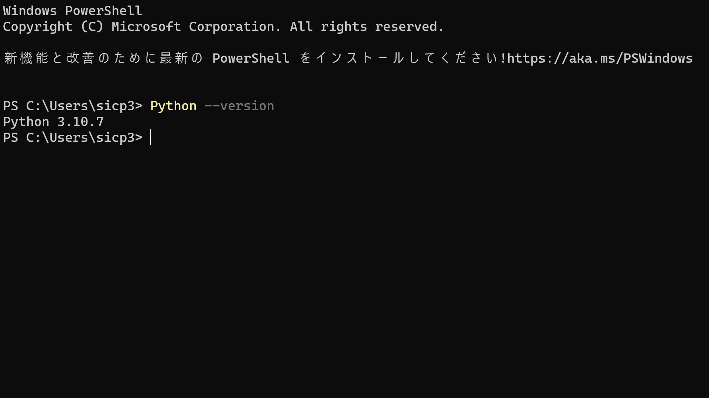

# 使い方
## pythonの開発環境の構築
まずは以下のリンクより、python3をインストールしてください。 
[python3.7のインストール](https://www.microsoft.com/p/python-37/9nj46sx7x90p?activetab=pivot:overviewtab) 
これがインストール出来たら、スタート メニュー (左下の Windows アイコン)からwindows powershellを起動し、**Python --version**と入力し、Enterを押します。 
すると、以下のように表示されます。このように表示されていたらインストール成功です。
 
windows powershellで**Python --version**と実行した結果(筆者の場合、バージョンが3.10.7であることが分かる。)
このようにしてpythonがインストールされていることを確認したら、以下のリンクよりVisual Studio Codeをインストールしてください。 
[Visual Studio Codeのインストール](https://code.visualstudio.com/sha/download?build=stable&os=win32-x64-user) 
インストール出来たら、以下のリンクより、日本語化パッケージとPython用の拡張機能をダウンロードしてください。 
[Japanese Language Pack for Visual Studio Code](vscode:extension/MS-CEINTL.vscode-language-pack-ja) 
[python用拡張機能](vscode:extension/ms-python.python) 
