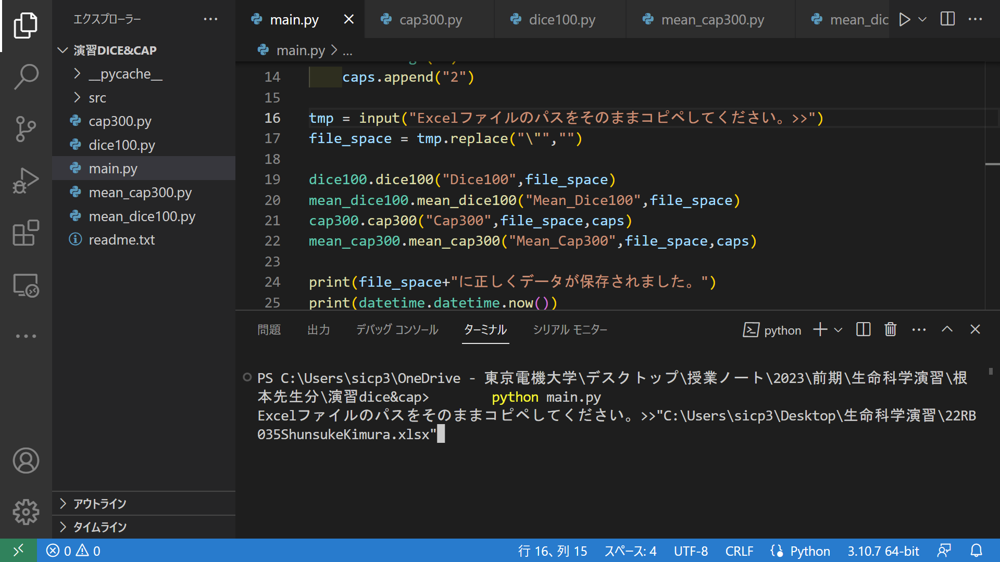
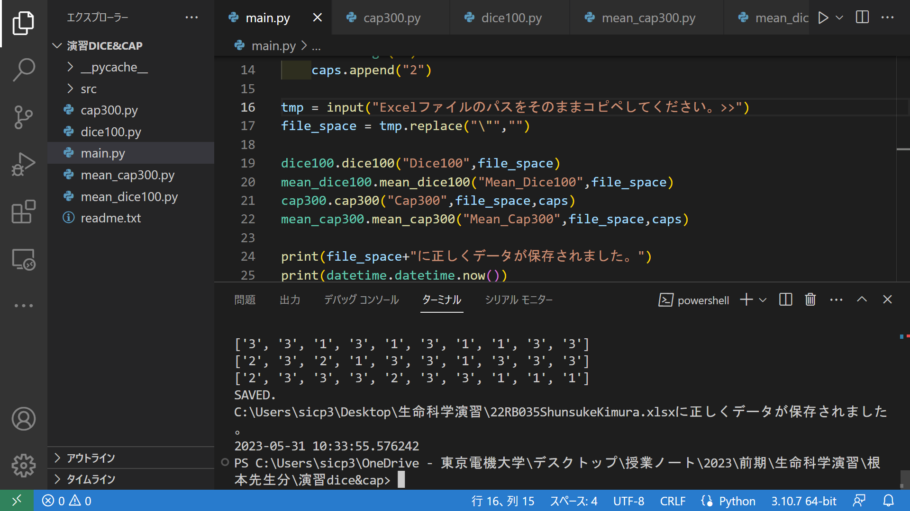
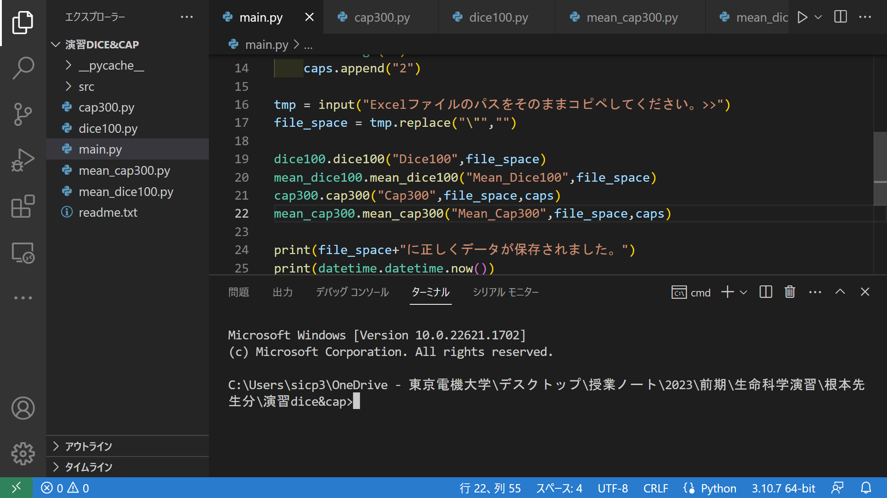
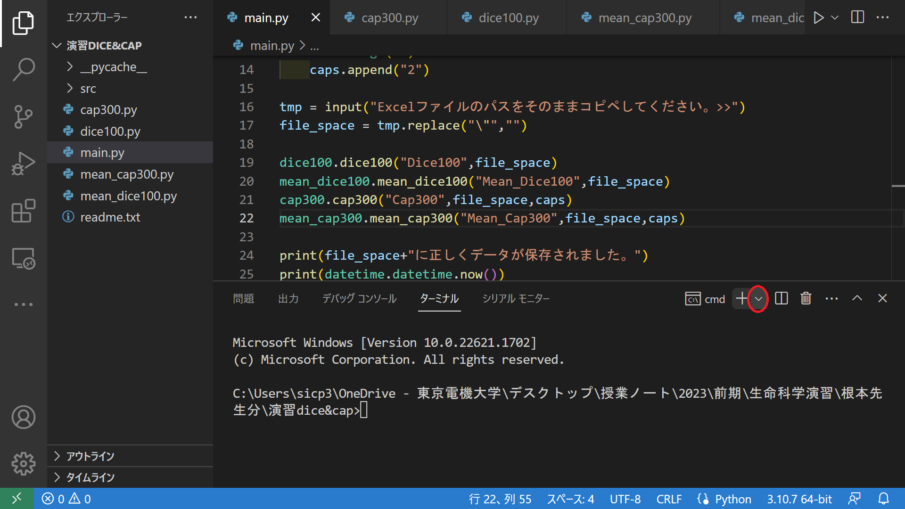
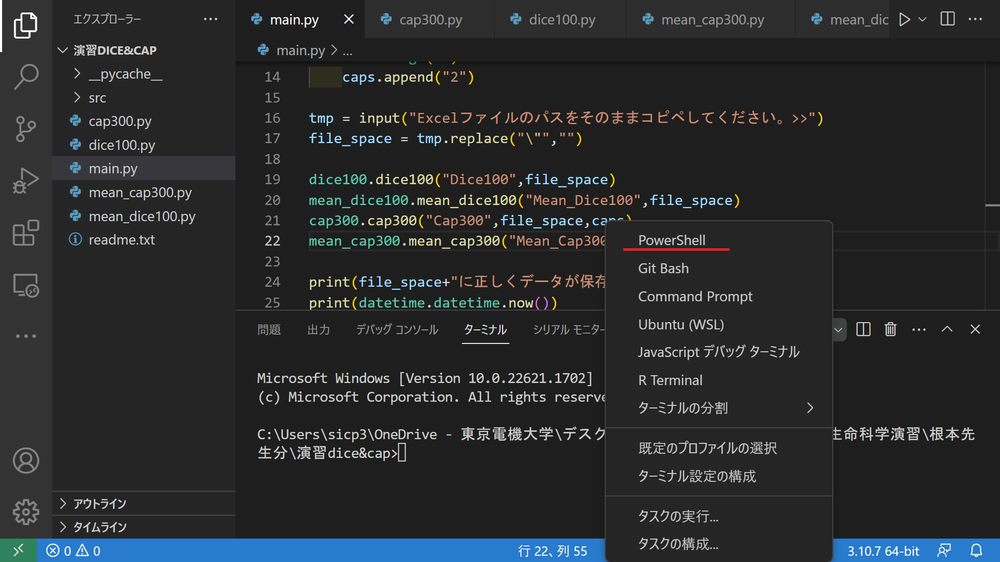
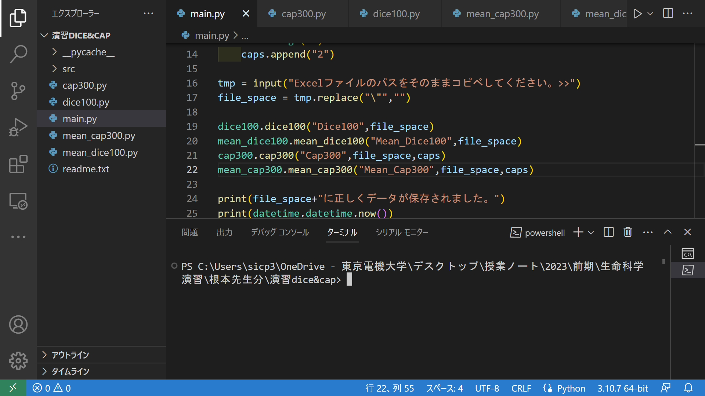

# 使い方(for Windows)
## pythonの開発環境の構築
まずは以下のリンクより、python3をインストールしてください。<br>
[python3.7のインストール](https://www.microsoft.com/p/python-37/9nj46sx7x90p?activetab=pivot:overviewtab)<br>
これがインストール出来たら、スタート メニュー (左下の Windows アイコン)からwindows powershellを起動し、**Python --version**と入力し、Enterを押します。<br>
すると、以下のように表示されます。このように表示されていたらインストール成功です。
<br>
windows powershellで**Python --version**と実行した結果(筆者の場合、バージョンが3.10.7であることが分かる。)<br>
このようにしてpythonがインストールされていることを確認したら、以下のリンクよりVisual Studio Codeをインストールしてください。<br>
[Visual Studio Codeのインストール](https://code.visualstudio.com/sha/download?build=stable&os=win32-x64-user)<br>
インストール出来たら、以下のリンクより、日本語化パッケージとPython用の拡張機能をダウンロードしてください。<br>
[Japanese Language Pack for Visual Studio Code](https://marketplace.visualstudio.com/items?itemName=MS-CEINTL.vscode-language-pack-ja)<br>
[python用拡張機能](https://marketplace.visualstudio.com/items?itemName=ms-python.python)<br>
ダウンロード出来たら、Visual Studio Codeを起動しましょう。
起動出来たら、Python 3 インタープリターを選択します。コマンド パレットを開き (**Ctrl + Shift + P**)、検索するコマンド「**Python: Select Interpreter**」の入力を開始して、コマンドを選択します。<br>
<br>
「Python: Select Interpreter」と打ち込み、エンター<br>
<br>
表示されたpythonを選択<br>

## 本プログラムの使い方
まずは以下のリンクから、このプログラム全体をダウンロードしてください。<br>
[Download here](https://github.com/kimshuno213kr/dice_and_caps/archive/refs/heads/main.zip)<br>
ダウンロード出来たら、エクスプローラーを開き、ダウンロードされたファイル(dice_and_caps-main.zip）を右クリックし、展開（解凍)しましょう。<br>
展開先は任意の場所で構いませんが、覚えておくようにしてください。<br>
展開が完了したら、Visual Studio Codeを開きましょう。<br>
visual studio codeを開いたら、先ほど展開したフォルダを開きましょう。<br>
**Crl +K+ 0**でフォルダ選択のウィンドウを開き、先ほど展開したフォルダ（**ダウンロードしたzipでないことに注意**）を選択し、開いてください。<br>
開けたら、ターミナルを開き（**Ctrl + Shift + @** ）ましょう。<br>
ターミナルがpowershellであることを確認しましょう。もし異なった場合は、後述の章を参考にpowershellを起動してくださいくbr>
<br>
powershellであることが確認出来たら、以下のようにコマンドライン(PS C:\Users\○○\○○>の部分)に以下のように打ち込んで、Enertを押してください。<br>
```bash:pip
pip install openpyxl
```
終了したらエクスプローラーを開き、演習でデータを記録するためにダウンロードしたExce1ファイルを選択し、PATHをコピー（右クリックから「パスのコビー」又は(**Ctrl + Shift ＋ C** ）しておきましょう。<br>
この際、Excelファイルを開いてしまった場合は必ず閉じるようにしてください。<br>
コピー―が出来たら、Pythonを実行します。<br>
コマンドラインに以下のように入力し、Enterを押します。
```bash
python main.py
```
実行すると、「Excelファイルのパスをそのままコピペしてください。>>」と表示されるので、その状態で**コマンドライン上で右クリック(Ctrl+Vでないことに注意)** をし、ペーストしましょう。
<br>
正しくペーストされていることを確認して、Enterを押します。すると、実行が再開されます。<br>
以下のように表示されれば、実行が終了し、正しく保存されています。
<br>
<br>
最も起こりえるエラー
```bash
PermissionError: [Errno 13] Permission denied: 'C:\\Users\\○○\\○○\\○○.xlsx'
```
が発生した場合は、Excelファイルを開いたまま実行していることが考えられます。<br>
このプログラムを実行する際は、必ずデータを記録するExcelファイルは閉じた状態で実行してください。

## powershell以外のターミナルが開いている場合

このように、powershell以外が開かれていた場合、以下の流れでpowershellを開くことができます。<br>

赤丸の部分を押し、<br>

powershellを選択<br>

とすると、powershellが選択されていることが分かります。
